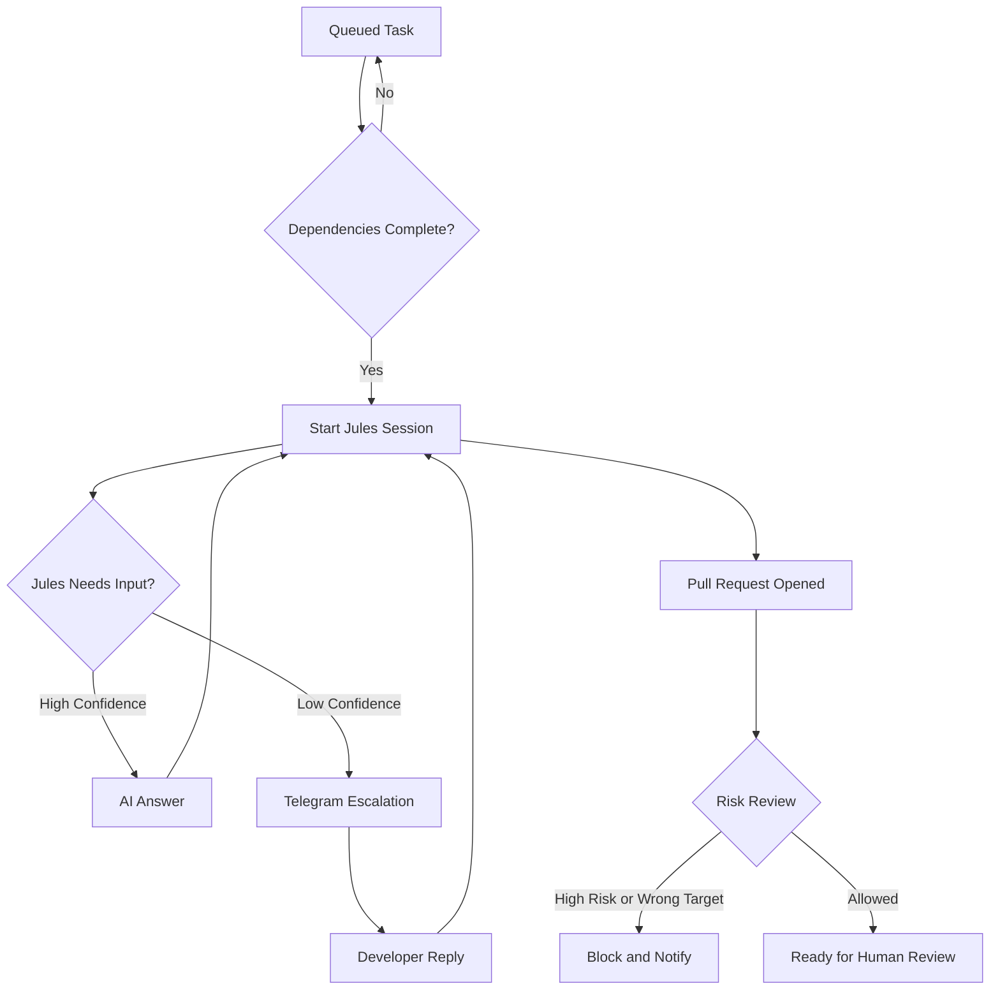

# Jules Supervisor

Jules Supervisor is a Node.js orchestration dashboard for supervising Google Jules coding sessions. It coordinates task execution, handles task dependencies, monitors session state, routes Jules questions to AI models or a human developer, and keeps pull-request automation inside a safer phase-branch workflow.

The project is a portfolio-grade automation system for exploring how AI coding agents can be supervised with explicit boundaries instead of being left to run unattended.

## What It Does

- Creates and tracks multi-task development phases
- Runs dependent tasks in sequence and independent tasks in parallel
- Monitors Jules sessions and task state transitions
- Answers low-risk Jules questions with AI when confidence is high
- Escalates uncertain questions to Telegram for human input
- Reviews pull requests before they are considered ready
- Blocks high-risk pull requests from auto-merge paths
- Prevents direct automation merges into `main`
- Provides a browser dashboard for phase setup, live status, Q&A, and task controls

## Why This Project Exists

AI coding agents can move quickly, but production engineering still needs guardrails:

- Tasks should respect dependencies.
- Ambiguous questions should not be guessed blindly.
- Risky code should require human review.
- Main branches should stay protected.
- Secrets and sensitive files should never be exposed through the portal.
- Automation should produce an audit trail a developer can inspect.

Jules Supervisor is built around those constraints.

## Tech Stack

| Layer | Technology |
| --- | --- |
| Runtime | Node.js 20+, ES modules |
| API | Express 4 |
| Database | MySQL 8, `mysql2` |
| Dashboard | Static HTML/CSS/JavaScript served by Express |
| Agent API | Google Jules REST API |
| Repository automation | GitHub REST API |
| AI routing | Google Gemini and OpenRouter-compatible models |
| Human escalation | Telegram Bot API |
| Tests | Node's built-in test runner |

## Architecture

```text
Developer
    |
    v
Web Dashboard
    |
    v
Express API
    |
    +--> Phase and task management
    +--> Status polling
    +--> Telegram webhook handling
    +--> Portal authentication
    |
    v
Core Supervisor
    |
    +--> Task dependency manager
    +--> Jules session handler
    +--> Question handler
    +--> PR reviewer
    +--> Background poller
    |
    +--> Google Jules API
    +--> GitHub API
    +--> Gemini / OpenRouter
    +--> Telegram Bot API
    |
    v
MySQL
```

## Project Structure

```text
jules-supervisor/
├── server.js
├── docker-compose.yml
├── package.json
├── package-lock.json
├── .env.example
├── src/
│   ├── api/          # Express routers, auth, webhook and request blocking
│   ├── core/         # orchestration, polling, task flow and PR review logic
│   ├── db/           # MySQL connection, schema and queries
│   ├── portal/       # browser dashboard
│   └── services/     # Jules, GitHub, AI and Telegram service clients
└── tests/            # safety, security, dependency and system tests
```

## Quick Start

### 1. Install dependencies

```bash
npm install
```

### 2. Create local configuration

```bash
cp .env.example .env
```

Fill in the values for MySQL, Jules, GitHub, AI providers, Telegram, and `PORTAL_SECRET`.

### 3. Start MySQL

```bash
docker compose up -d db
```

### 4. Run the app

```bash
npm run dev
```

Open the dashboard at:

```text
http://localhost:3000
```

## Environment Variables

The app reads runtime secrets from `.env`. The real `.env` file is intentionally ignored by Git.

Important variables:

| Variable | Purpose |
| --- | --- |
| `PORTAL_SECRET` | Shared secret for dashboard API access and Telegram webhook path protection |
| `DB_HOST`, `DB_PORT`, `DB_NAME`, `DB_USER`, `DB_PASS` | MySQL connection settings |
| `JULES_API_KEY`, `JULES_BASE_URL`, `JULES_REPO_SOURCE` | Jules API integration |
| `GITHUB_TOKEN`, `GITHUB_OWNER`, `GITHUB_REPO` | GitHub repository automation |
| `GEMINI_API_KEY` | Google Gemini model access |
| `OPENROUTER_API_KEY`, `OPENROUTER_BASE_URL` | OpenRouter-compatible fallback model access |
| `TELEGRAM_BOT_TOKEN`, `TELEGRAM_CHAT_ID` | Human escalation through Telegram |

Use [`.env.example`](./.env.example) as the template.

## Dashboard

The dashboard provides:

- Phase draft creation
- Task dependency selection
- Active phase tracking
- Task timeline and status board
- Q&A review flow
- Manual task actions
- Poller health visibility

It is intentionally a private operator dashboard, not a public multi-user SaaS application.

## Supervisor Flow



## Safety Model

Jules Supervisor is designed around conservative automation.

- **Phase branch isolation:** Work is routed into a phase branch instead of directly into `main`.
- **No automatic main merges:** Final merges into `main` are left to a human developer.
- **Wrong-target blocking:** Pull requests targeting protected branches are blocked and corrected.
- **Risk classification:** Auth, security, schema, migration, environment, secret, and automation-sensitive changes are treated as high risk.
- **Human escalation:** Low-confidence answers and blocked PRs are routed to Telegram.
- **Sensitive path blocking:** The Express middleware blocks direct requests for dotfiles, configuration files, package metadata, and source paths.
- **Secret hygiene:** Real secrets live in `.env`, which is ignored by Git.

## Testing

Run the test suite:

```bash
npm test
```

The tests cover:

- Task dependency behavior
- Safety and branch isolation rules
- Webhook and portal security behavior
- System-level supervisor flows

## Public Release Notes

Before making a fork or deployment public:

- Keep `.env` private.
- Rotate any previously shared `PORTAL_SECRET`.
- Use a GitHub token with the smallest permissions needed.
- Use a dedicated Telegram bot and chat for escalation.
- Review model-provider privacy terms before sending sensitive project context.
- Keep `NEVER_MERGE_TO_MAIN=true` unless you are intentionally changing the safety policy.

## Current Status

This is an active portfolio project. The core orchestration, safety rules, Telegram integration, AI routing, and dashboard flows are implemented, but production deployments should still add stronger authentication, structured logging, deployment hardening, and operational monitoring.

## License

No license has been selected yet. Add one before inviting external reuse or contributions.
