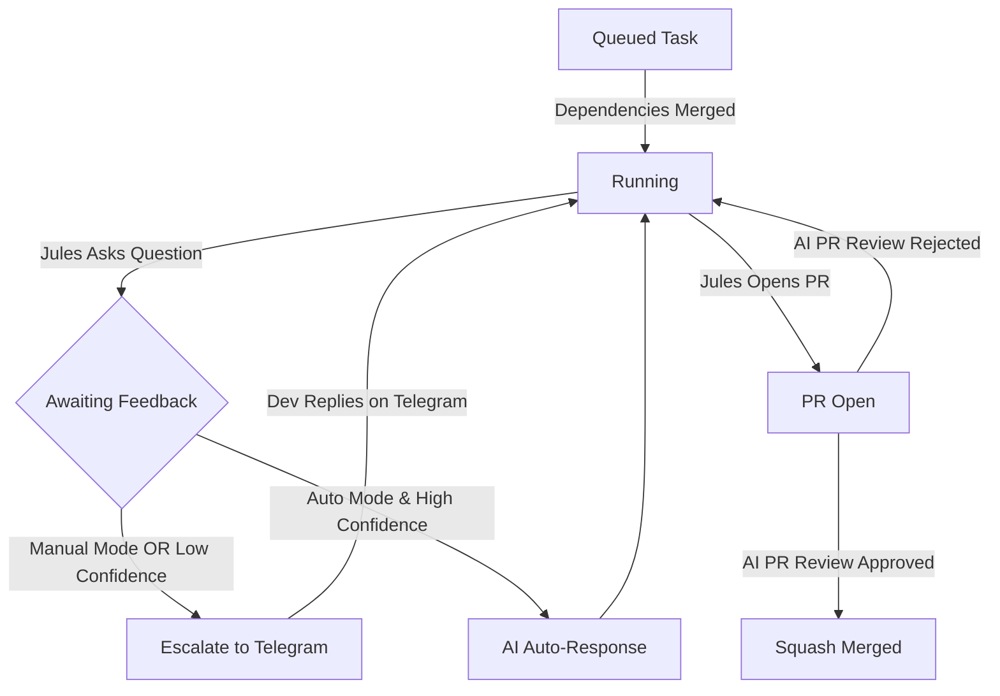

# Jules Supervisor

Jules Supervisor is an autonomous supervisor web application for **Google Jules**. It reads sprint plans, coordinates Jules coding sessions in parallel or sequence (handling task dependencies), monitors active session states, resolves Jules questions automatically using Gemini/DeepSeek (or escalates them to a developer via Telegram when confidence is low), and reviews and merges pull requests when complete.

---

## 🛠 Tech Stack

- **Runtime**: Node.js 20+
- **Framework**: Express 4
- **Database**: MySQL 8
- **AI Integrations**:
  - Google Gemini 2.5 Flash (via Gemini API)
  - DeepSeek V4 Pro (via Kilo Gateway)
- **APIs**:
  - Jules REST API v1alpha
  - GitHub REST API v3
  - Telegram Bot API

---

## 📂 Project Structure

```
jules-supervisor/
├── server.js               # Application entry point
├── .env.example            # Environment template configuration
├── .gitignore              # Files ignored by Git
├── package.json            # NPM dependencies and scripts
└── src/
    ├── api/
    │   ├── auth.js         # Basic token validation middleware
    │   ├── sprints.js      # Sprint creation and start endpoints
    │   ├── status.js       # Live metrics polled by the web portal
    │   └── webhook.js      # Handler for Telegram webhooks
    ├── core/
    │   ├── contextBuilder.js    # Consolidates active task context
    │   ├── taskManager.js       # Manages queued tasks and dependencies
    │   ├── questionHandler.js   # AI and developer interaction flow
    │   ├── prReviewer.js        # Automates code reviews and squash-merging
    │   ├── sessionHandler.js    # Individual Jules session state transitions
    │   └── poller.js            # Main orchestration polling loop
    ├── db/
    │   ├── connection.js   # DB connection pool setup & schema runner
    │   ├── schema.sql      # Database schema
    │   └── queries.js      # DB query helper functions
    ├── portal/
    │   └── index.html      # Responsive glassmorphism web dashboard
    └── services/
        ├── ai.js           # Gemini Flash and DeepSeek client
        ├── github.js       # GitHub branch and PR client
        ├── jules.js        # Google Jules API client
        └── telegram.js     # Telegram Bot integration
```

---

## 🚀 Getting Started

### 1. Setup Environment
Copy the example configuration to create your `.env` file:
```bash
cp .env.example .env
```
Populate the configuration values inside `.env` including your database credentials, API keys, and repository metadata.

### 2. Install Dependencies
```bash
npm install
```

### 3. Run the Server
```bash
# Start in development mode (watches for changes)
npm run dev

# Start in production mode
npm start
```
The server will automatically verify and run the table creation statements on your configured database and listen on port `3000`.

---

## 🌐 Web Dashboard

Once the server is running, open `http://localhost:3000` in your browser.

- **Portal Secret Key**: Enter your `PORTAL_SECRET` in the top right header to authenticate API requests.
- **Sprint Creator**: Fill in sprint targets, create plan context sections, add tasks, choose supervisor mode (Auto vs Manual), select task context sections, and define task dependencies.
- **Live Board**: Track task execution in real time (queued, running, waiting answer, PR open, merged, failed).
- **QA Logs**: See all automated answers generated by the AI and decisions escalated to Telegram.

---

## 🤖 State Machine Flow


